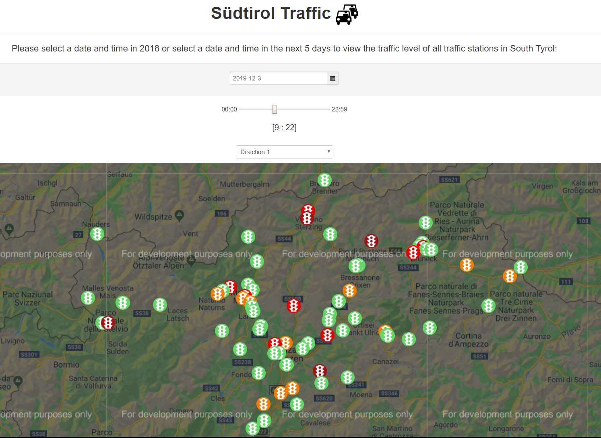
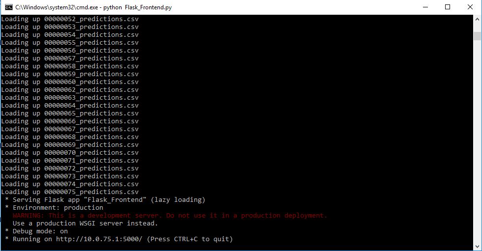
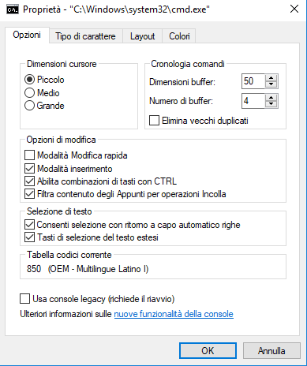
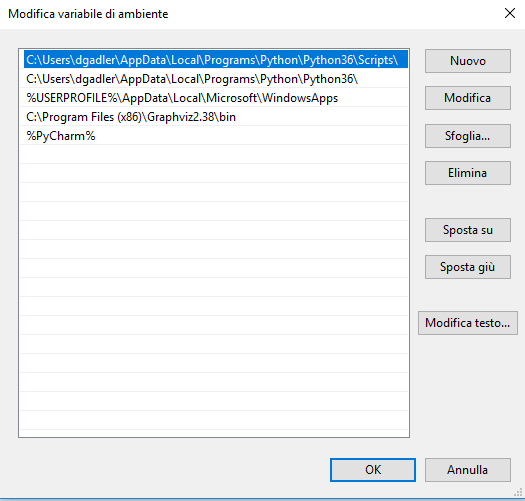

# Südtirol Traffic - Machine Learning Prototype


This prototype aims at showcasing the traffic evolution in the year 2018 on the streets of the Autonomous
Province of Bolzano-Bozen and create Machine Learning models that are able to model the main trends
and predict the future traffic level based on week of the day, hour and weather. 

The data used stems from 71 traffic sensors scattered all over the main streets of the Autonomous Province
of Bolzano-Bozen and pre-processed in SAS, along with the weather data coming from the corresponding closest 
weather station. 



## Machine Learning models used:


### Classification:

Approx. 95% classification accuracy into the four traffic categories

- Decision Tree
- KNN
- Random Forest
- Ensemble of the three considered models

### Regression:

- Fully-connected Neural Network


## Setup - Python and dependencies:

### 1. Python Installation in Windows:

Go to the official Python website, download and install the Python 3.6.8 version, as that is the version with that the 
protype was created and tested. Python version 3.6.9 and Python 3.7.4 was also tested and found to be compatible.

Download link: https://www.python.org/ftp/python/3.6.8/python-3.6.8-amd64.exe

When prompted whether to add Python to your system path, say "YES".

If you want to check if Python was successfully installed, press Windows + R, and enter "cmd". 
In the command line prompt, type "python". If the Python interpreter for Python 3.6.8 is launched,
then you have successfully installed Python 3.6.8, as shown in the following picture.

Alternatively, install Conda as package manager and create a new environment for Python 3.6:

```bash
conda create -n <env_name> python=3.6
```


### 2. Python Packages for Training and inference

Navigate to the folder where the repository was cloned, and then install the packages contained in the requirements.txt
file.

```bash
pip install -r requirements.txt
```


## Training and Inference - How To

Make sure the data in 'd/Stations_Past_2018' and 'd/data_frame_tratte_meteo_suedtirol_fixed.csv' is present,
then follow the following procedures to proceed with the training and inference procedures.

### 1. Training - Once

It is sufficient to run the training algorithms once to generate models, which will be output to the 
'd/Stations_Models_2018'. 

```bash
python run_operations.py train
```

Re-training the ML models should take about ~2-3 hours, depending on your CPU. 

### 2. Inference, once per day.

NB: Inference uses the trained models, scalers and encoders serialized in the 'Stations_Models_2018'. 
 
Whenever the weather webservice is updated (once per day) or we want to get new traffic predictions,
we may refresh the predictions for the next 5 days and populate the 'Stations_Predictions_2018' folder. 
In order to run the inference phase of the ML algorithms, run the following lines. An internet connection
is required in order to access the Province of Bolzano's weather forecast webservice.

```bash
python run_operations.py inference
```

Running the inference phase with already-generated ML models should take approx. ~5-10 minutes, depending on your CPU. 

If the inference phase completes successfully, you should see the following output in the 'Stations_Predictions_2018' 
folder:


## PyTest for Training and Inference

In order to run the tests for the Python code and get a report of the test cases' coverage, as well
just run the following commands. The test cases are useful to verify whether all your dependencies
have been installed correctly, and manually inspecting them can provide information on the code's
functioning. 

```
pytest --cov --ignore=app.py,run_operations.py . 

```

# Frontend - Flask Web app

Refer to the following folder:


```
flask_webapp

```


## Frontend Features:

1) Historical data visualization on a Google Map: If selecting a date and time in the year 2018 on the index 
webpage, it is possible to visualize the traffic level in any of the 71 vehicle-counter sensors in Alto Adige. 

2) Traffic prediction on a Google Map: If selecting a date and time in any of the following 5 days from today,
it is possible to view the traffic level on any of the 71 traffic sensors, based on the closest weather predictions
of the Province of Bolzano-Bozen's webservice. 

3) Heatmap, by navigating to the <ip_address:port>/heatmap?id=[1-71], it is possible to view the heatmap of the 
traffic level predictions in the following 5 days for the specific station with the ID specified. This visualization
is also accessible via the Index Google Map by clicking on a station, and then hitting "View Heatmap".

## Cloud deployment - Azure resources

This application uses the following resources in Azure:

- Resource Group 
- Web App Service plan with Linux
- App Service Plan running Linux. For good QoS, pick P2V2 / P3V2. Otherwise, the free tier will also do 
if no intense processing needs to be carried out.


### 1. Create Azure resources

Navigate to portal.azure.com and create in a known resource group or a new resource group:
 1) A Web App service plan with the "General Settings" highlighted above
 2) An App Service Plan
 

### 2. Deploy the application

Follow *Step 3 - Deployment* of this excellent tutorial to deploy the local application :

https://medium.com/@nikovrdoljak/deploy-your-flask-app-on-azure-in-3-easy-steps-b2fe388a589e


(First time only)

Add the upstream git for the Azure web app. The git clone URL can be obtained from the web application interface --> Deployment Center and copy-pasting the "Git Clone URL".

```
git remote add azure-traffic <azure_repository_url>
```

### 3. Push changes to the Azure webservice:

If you want to push a new version of the application to Azure, just run the following commands. Make sure the SIAG's http_proxy
and https_proxy are indeed active in your environment variables.

```
git add .
git commit -m "Your commit message"
git push azure-traffic
```

When prompted for your credentials, provide the ones in the 'Deployment Credentials' page.


## Localhost deployment:

Follow all the bullets below:


### 1. Repository download

- **If you have Git installed** : Perform a git clone of this repository in any folder you desire. By default, we're going to install it
in the Documents folder.

```javascript
cd %USERPROFILE%\My Documents
git clone git@github.com:DanyEle/SIAG_ML_Traffic.git
```

- **If you do not have Git installed**, just download the whole repository as a .zip file from Git manually and extract it
in the Documents folder. 


### 4. Python Packages

Navigate to the folder where the repository was cloned, and then install the packages contained in the requirements.txt
file.

```bash
cd flask_web_app
pip3 install -r requirements.txt
```


## Usage

### 1. Run the Flask Frontend
Finally, in order to run the Flask frontend and visualize the past data, along with the predictions, run the following commands
to start up the Flask webservice on your IP. Such IP will be reached by all IP addresses within the SIAG intranet.

```bash
cd flask_web_app
python app.py
```

You may have to hit "ENTER" twice for this last command in order for the parsing to begin.

If the Flask frontend has been initialized successfully, you should see the following output in the console:



### 2. Access the Flask Frontend

Open up a browser and type in the address and port shown in the console where the Flask frontend was started.
You should finally be able to access the Südtirol traffic service! In my case, I just type in my browser the
following address:

```bash
http://<localhost>:5000/
```

If everything went well, you will be able to view the traffic level in South Tyrol! Good job!


## Troubleshooting

**Issue**: The webservice console gets stuck and does not process any incoming request.

**Solution**:  Do not click with your mouse on the console where the flask frontend was initialized, or the Flask webservice will 
get blocked until you click again or press any key. This is a default behaviour of the command prompt in Windows 10.

Such behaviour can be disabled by right-clicking on the command prompt bar top bar, selecting "Defaults"/"Predefinite"
or just for the current shell by selecting "Properties" and then unchecking the checkbox "QuickEdit Mode" / "Modalità modifica rapida", 
as shown in the following picture:



**Issue**: Python is not recognized in your command prompt.

**Solution**: Search for the directory where Python is installed, and add it to the Path environment variable. 
By default, the installation directory of Python is C:\Users\<username>\AppData\Local\Programs\Python\Python36

**Issue**: pip3 is not recognized as a program
By default, the installation directory of pip is C:\Users\<username>\AppData\Local\Programs\Python\Python36\Scripts

**Solution**: Add the installation folder of pip to the environment variables.



**Issue**: No package can be found for Tensorflow.

**Solution**: You have a too new version of Python (EX: Python 3.8.0). Uninstall your current version of Python, and install
Python 3.6.8 or Python 


